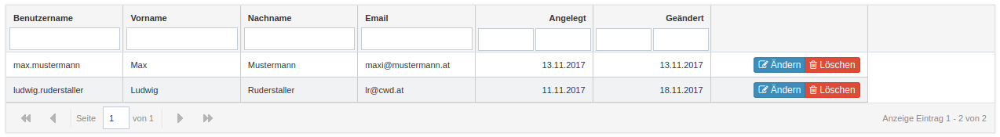

cwdFancyGridBundle
=================

[](https://gemnasium.com/github.com/cwd/cwdFancyGridBundle)
[](https://scrutinizer-ci.com/g/cwd/cwdFancyGridBundle/?branch=develop)
[](https://packagist.org/packages/cwd/fancygrid-bundle)
[](https://packagist.org/packages/cwd/fancygrid-bundle)
[](https://packagist.org/packages/cwd/fancygrid-bundle)


This bundle integrates the JQuery FancyGrid into Symfony. see https://fancygrid.com for details.



For many more examples see https://fancygrid.com/samples/


Installation
------------

`composer require cwd/fancygrid-bundle`

Add to AppKernel.php:
```
[...]
new Cwd\FancyGridBundle\CwdFancyGridBundle(),
[...]
```

Or bundels.php:
```
[...]
'Cwd\FancyGridBundle\CwdFancyGridBundle' => ['all' => true],
[...]
```

Add to config.yml (you can use all javascript options see https://fancygrid.com/api/config):
```
cwd_fancy_grid:
  js_options:
    theme: 'bootstrap'
    height: 'fit'
    trackOver: true
    i18n: '%locale%'
    menu: true
    selModel: 'row'
    striped: true
    columnLines: false
    searching: true
    textSelection: true
    refreshButton: true
    defaults:
      resizable: true
      sortable: true
      menu: true
    controllers: ['cwdcontrol']  
```

If you have a license add it to the config:
```
cwd_fancy_grid:
  license: '1234123123123123123123123'
  [...]
```

Create your first Grid:
```
<?php
namespace AppBundle\Grid;

use Cwd\FancyGridBundle\Column\NumberType;
use Cwd\FancyGridBundle\Column\TextType;
use Cwd\FancyGridBundle\Grid\AbstractGrid;
use Cwd\FancyGridBundle\Grid\GridBuilderInterface;
use Doctrine\Common\Persistence\ObjectManager;
use Doctrine\ORM\QueryBuilder;
use Symfony\Component\OptionsResolver\OptionsResolver;
use Symfony\Component\OptionsResolver\OptionsResolverInterface;

class UserGrid extends AbstractGrid
{
    /**
     * @param GridBuilderInterface $builder
     * @param array                $options
     */
    public function buildGrid(GridBuilderInterface $builder, array $options)
    {
        $builder->add(new NumberType('id', 'u.id', ['label' => 'ID', 'identifier' => true]))
                ->add(new TextType('firstname', 'u.firstname', ['label' => 'Firstname']))
                ->add(new TextType('lastname', 'u.lastname', ['label' => 'Lastname']))
                ->add(new TextType('email', 'u.email', ['label' => 'Email']));

    }

    /**
     * @param OptionsResolver $resolver
     */
    public function configureOptions(OptionsResolver $resolver)
    {
        parent::configureOptions($resolver);

        $resolver->setDefaults(array(
            'default_sorts' => array('u.id' => false),
            'data_route' => 'app_user_ajaxdata',
        ));
    }


    /**
     * @param ObjectManager $objectManager
     * @param array         $params
     *
     * @return QueryBuilder
     */
    public function getQueryBuilder(ObjectManager $objectManager, array $params = [])
    {
        $qb = $objectManager
            ->getRepository('AppBundle\Model\User')
            ->createQueryBuilder('u')
            ->orderBy('u.lastname', 'ASC');

        return $qb;
    }
}
```

Add the controller actions:
```
<?php
class UserController {
    [...]
      
    /**
    * @param Request $request
    *
    * @Route("/list/data")
    * @Method({"GET", "POST"})
    * @return JsonResponse
    */
    public function ajaxDataAction(Request $request)
    {
       $options = [
           'filter' => urldecode($request->get('filter', '')),
           'page' => $request->get('page', 1),
           'sortField' => $request->get('sort'),
           'sortDir' => $request->get('dir'),
       ];
    
       $grid = $this->getGrid($options);
       $data = $grid->getData();
    
       return new JsonResponse($data);
    }
       
    /**
     * @Route("/list")
     * @Route("/")
     * @Method({"GET"})
     * @Template("AppBundle:Grid:list.html.twig")
     * Security("has_role('ROLE_ADMIN')")
     *
     * @return array
     */
    public function listAction()
    {
        $grid = $this->getGrid();

        return array(
            'grid'        => $grid,
        );
    }  
         
    /**
     * @param array $options
     *
     * @return GridBuilderInterface
     */
    protected function getGrid(array $options = [])
    {
        return $this->get('cwd_fancygrid.grid.factory')->create(UserGrid::class), $options);
    }     
```

And the view:
```
<div id="{{ grid.id }}" style="width:99%"></div>
<script type="text/javascript">
    {{ fancygrid(grid) }}
</script>

{# Add the Javascript and CSS files (after jQuery is loaded) #}
<script type="text/javascript" src="https://cdn.fancygrid.com/fancy.full.min.js"></script>
<link rel="stylesheet" href="https://code.fancygrid.com/fancy.min.css" />    
```
